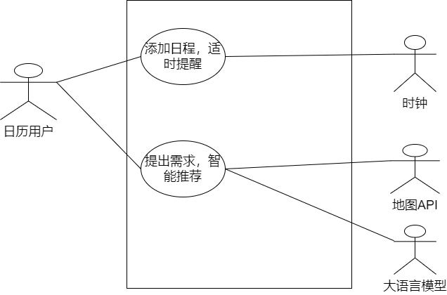

# 小组实践项目——选题

## 名字

$\text{Singularity-Odyssey}$​ —— **奇点奥德赛**

## 项目图标

## 背景

科技哲学致力于回答诸如什么是技术，技术如何更好地造福人类等问题，技术革命之初，人们畅想着技术能够消除不平等、贫困、资源紧缺等社会难题。然而我们环顾四周，审视自己的生活，心生疑惑，为什么旧有的社会尚未解决，新的难题又随着技术接踵而至：新的教育和收入差距越来越大，人类之间的隔阂，种族歧视、性别冲突在互联网的沃土上被无限放大，孩子被鱼龙混杂的信息裹挟着被迫早熟，而成人在愈加固化的社会夹层里日度，忘记了曾经短暂拥有过的感知力和想象力。

而当下，新一波科技浪潮汹涌袭来，我们迫切地需要审度技术和人类之间的关系。

我们真的比从前更幸福了吗？我们如何找回自己的想象力？
我想答案来自于博物学家巴勒斯的信条：“了解只是一半，而爱是另一半。”
技术如何弥合它本身腐蚀性的力量？
我想，“向外望”是良方。

我们希望用技术的力量不仅仅吸引人们的目光，更希望把这目光引向更深远的地方，引向想象和爱的初生地。我们希望把人们的目光引向辽远的太空，遥想无限以知有限；同时，我们希望以文学为钥匙打开生活本身深奥之境，感知细微以至永恒。

我们更希望，技术能结合这些理念，开发出一款能带给人们想象力和感知力的应用。

## 问题

- 一般人们常用的规划软件主要是日历，但是日历存在着不够智能的缺陷，比如我们当我们键入一些介词或者和一些附加信息时，目前的识别很容易将其**识别错误**，以及如果我们想要一系列在每周重复的事件，我们需要**自行手动选择很多内容**。
  
  

- 目前的日历功能**不够集成完善**，比如当我们上午下课后，我们想要去吃饭，锻炼，或者休息，我们需要考虑目的地点，然后还需要考虑来回往返的时间（如果目前位于一个陌生的地方还需要查询导航），而在这个过程中，我们就会浪费很多的时间。

- 目前的日历一般**没有检测冲突的功能**，对于两个相隔比较近的时间，我们经常希望日历能够自动检测冲突（比如从一个地点赶到另一个地点所需要的时间），或者说当你需要规划一件事情的时间时，我们时常希望**能够自动选择合适的时间**（比如当同学询问晚上什么时候有空出去转转，我们时常期望告诉日历模糊的时间——晚上，日历能够自动根据目的地的距离和待完成事项来**自动生成推荐**的时间）。

- 个性化不足，对于目前的日历，**缺乏一些个性化的元素**，比如背景样式的局限性，比如安排时间的偏好等。

## 目标

我们的目标是希望能够设计一款智能化的日历，能够解决上述提到的一系列问题。

由于目前**大语言模型**能力的完善，我们可以通过调用外部 API 的方式来产生一系列事件的关键词，通过这些关键词来根据之前的集成逻辑进行日历的增删改查。

对于规划方面，很多地图软件都开放了相应的 API。

在此基础上，我们加入一些基本的逻辑即可完成规划的内容，并且，我们希望能够通过 弹窗，QQ 或者短信提醒的方式来**提示用户临近的事项**。

而对于考虑一些吃饭，锻炼，休息或者娱乐的地方，可以通过调取美团，大众点评等 API 的附近商铺列表，然后根据本地部署的推荐系统等来**进行智能的推荐**。

还可以通过用户自定义的方式来产生一些个性化的界面，可以通过调用接口，也可以通过对话的方式进行 AI 的辅助设计。

对于这款软件的预期效果，我们希望能将所有的交互集成在一个聊天框中，同样的，我们也会开放相应的接口用于手动调整。对于上述提到的组件功能我们希望能够满足，在此基础上，**通过组员之间的协商以及创新，再加入一些更能提升使用体验的组件**。

## 用户

我们的用户群体主要面向学生、上班族和自由职业者等，他们各自具有不同的特点。

| 学生                                                                      | 上班族                                                                 | 自由职业者                                                                    |
|:-----------------------------------------------------------------------:|:-------------------------------------------------------------------:|:------------------------------------------------------------------------:|
| 学生需要通过本软件管理学习计划、课程时间表、团队项目会议等。作为年轻一代，他们倾向于使用数字工具进行时间管理，**对智能化功能有较高期待**。 | 上班族需要通过本软件安排工作会议、商务出差、项目截止日期等。出于工作需求，他们寻求**效率提升**，需要减少日程冲突和时间管理的压力。 | 自由职业者需要通过本软件安排客户会谈、项目交付时间和个人时间。他们**不受固定日程约束**，需要**灵活**而强大的工具来适应不规则的工作模式。 |

## 用例模型
### 用例图

### 用例描述

|    用例名    |          主要参与者           |             用例目标             |
| :----------: | :---------------------------: | :------------------------------: |
|   日历页面   |        日历用户，时钟         |  为用户提供时间指示以及事件提示  |
| 日程添加页面 |           日历用户            |     为用户提供添加日程的接口     |
|   弹窗接口   |           日历用户            |        提示用户临近的事项        |
|   推荐页面   | 日历用户，大语言模型，地图API | 根据输入要求来自动生成推荐的项目 |

## 举例

| 学生                                              | 上班族                                                | 自由职业者                                       |
|:-----------------------------------------------:|:--------------------------------------------------:|:-------------------------------------------:|
| Alice 需要准备期末考试，通过软件自动**规划**每门课程的复习时间，并提前提醒重要日期。 | Bob 有一个重要的客户会议和一个医生预约，软件**自动提示**会议结束后合理的出发时间，避免迟到。 | Carol 需要在多个项目间分配时间，软件**自动优化日程**，确保高效完成任务。   |
| **团队项目会议**，软件帮助寻找所有成员的共同空闲时间，并提供在线会议链接。         | **出差规划**，软件根据会议地点和时间**自动推荐交通工具路线和酒店**。             | **寻找附近的咖啡店作为临时工作空间**，软件基于地理位置推荐评分高且适合工作的地点。 |

## 设备

- **个人电脑和笔记本电脑**：通过 Web 应用或客户端软件，支持更复杂的日程规划和团队协作功能。
- **智能手机和平板电脑**：作为最基本的接入设备，支持 iOS 和 Android 系统，方便用户随时查看和管理日程。（如果时间允许会进行扩展）
- **多端共享**：实现本地客户端与云服务器的数据同步共享，从而支持多设备管理日程。

## 软件解决方案

### 软件与硬件协作关系简述

在智能化规划助手 $\text{Singularity-Odyssey}$​ 中，软件与硬件的协作是提供**高效、个性化和智能化服务**的关键。**软件负责界面展示、用户交互、数据处理和智能决策**，而**硬件提供**必要的支持，如**计算能力、存储空间和传感器输入**。这种协作关系确保了应用能够在不同的设备上运行，并且能够利用设备的特定功能来**增强用户体验**。

### 硬件支持

- **计算能力**：处理器提供足够的计算能力来**运行复杂的算法和数据分析**，确保应用的流畅运行。
- **存储空间**：内存和存储设备用于**存储应用数据和用户信息**，以及缓存来自外部 API 的数据。
- **传感器输入**：GPS 定位、加速度计等传感器**提供环境和用户状态信息**，用于智能推荐和导航。
- **网络连接**：无线模块如 Wi-Fi 和蜂窝网络用于**访问云服务和同步数据**。

### 软件适配

- **跨平台兼容**：确保软件能够在**不同操作系统和硬件配置上运行**，如 Windows、macOS、Android和iOS。
- **响应式设计**：界面能够**适应不同屏幕尺寸和分辨率**，提供一致的用户体验。
- **硬件特性利用**：软件应该能够根据硬件的特定功能，如摄像头和指纹识别，提供增强的功能。

## 非功能性需求

### 1. 可用性

- **用户界面**：软件应提供直观、易于导航的用户界面，支持多语言和个性化设置，以满足学生、上班族和自由职业者不同的使用习惯。
- **交互设计**：应支持通过聊天框进行自然语言交互，以及通过图形用户界面（GUI）进行操作。
- **辅助功能**：软件应包含辅助功能，如语音输入和读屏软件兼容性，以支持视障用户。

### 2. 性能

- **响应时间**：软件应在用户输入后迅速响应，确保日历事件的快速创建和修改。
- **处理能力**：软件应能够处理大量并发用户请求，不影响性能。

### 3. 可靠性

- **错误恢复**：软件应能够在发生错误或崩溃后快速恢复，且不丢失用户数据。
- **数据备份**：应定期自动备份用户数据，以防数据丢失。

### 4. 安全性

- **数据加密**：所有用户数据应加密存储，以保护隐私。
- **访问控制**：应实施强有力的用户认证机制，确保只有授权用户才能访问其个人日历。

### 5. 可维护性

- **代码质量**：软件代码应遵循行业标准，易于理解和维护。
- **文档**：应提供完整的开发和用户文档，以便于未来的软件升级和维护。

### 6. 可扩展性

- **模块化设计**：软件应采用模块化设计，便于添加新功能和集成第三方服务。
- **API支持**：应提供API接口，允许开发者扩展软件功能。

### 7. 兼容性

- **多平台支持**：软件应兼容主流操作系统和设备，包括桌面和移动平台。
- **第三方集成**：应能与常用地图软件、美团、大众点评等服务无缝集成。

## 接口需求

### 外部 API 接口需求

#### 语言处理 API

- 用于解析用户输入的自然语言，**提取关键词和意图**，以便智能化地创建、修改和删除日历事件。
- 例如调用**智谱**大模型等其他**大型语言模型** API。

#### 地图和导航 API

- 用于计算从一个地点到另一个地点的预计旅行时间，以及提**供导航指引**。
- 例如调用 Google Maps、Baidu Maps 或其他地图服务商提供的 API。

#### 商业信息 API

- 用于获取用户周围的餐厅、健身房、娱乐场所等商业信息，以便**推荐**。
- 例如调用美团、大众点评等服务的 API。

### 用户通知接口需求

#### 短信和邮件服务 API

- 用于**发送提醒和通知**给用户。
- 例如集成短信服务商 API 如 Twilio，或邮件服务 API 如 SendGrid。

### 安全和认证接口需求

#### OAuth 或其他认证服务

- 用于用户登录和第三方服务的**安全认证**。
- 集成 OAuth 2.0 认证流程。

### 分析和反馈接口需求

#### 用户行为分析 API

- 用于**收集用户使用应用的数据**，以改进应用功能和用户体验。
- 例如集成 Google Analytics 或其他分析工具的 API。

#### 用户反馈收集 API

- 用于**收集用户的反馈和建议**。
- 例如集成第三方反馈工具如 UserVoice 的 API。

## 可行性及潜在风险

### 可行性分析

#### 技术可行性

$\text{Singularity-Odyssey}$ 智能化日历应用的开发需要考虑现有技术是否能够支持其设计理念。从技术角度来看，当前的软件开发框架、编程语言和第三方 API 服务已经足够成熟，可以支持开发此类应用。智能手机和个人电脑的普及也为应用提供了广泛的硬件基础。此外，大数据、机器学习和自然语言处理等技术的进步，为实现应用的智能化功能提供了可能。

#### 法律可行性

法律可行性要求项目符合相关的法律法规，特别是数据保护和隐私法律。由于应用将处理用户的个人信息和日程安排，必须确保符合如GDPR或中国网络安全法等法律要求。此外，与第三方 API 的集成也需要考虑合同和版权问题。

#### 操作可行性

操作可行性涉及到应用是否能够在目标用户群体中得到有效推广和使用。需要评估目标用户是否愿意接受新的智能化日历应用，以及他们对应用的易用性和功能的需求。用户培训和支持也是操作可行性的一部分。

#### 调度可行性

调度可行性关注项目是否能够在预定的时间框架内完成。这需要考虑项目管理和团队协作的效率，以及可能出现的时间延误风险。合理的项目规划和风险管理策略对于确保项目按时完成至关重要。

### 潜在风险

#### 技术风险

技术变化迅速，新技术的采用可能会带来不稳定性和兼容性问题。此外，依赖的第三方服务可能会更改 API 或服务条款，影响应用的功能。

#### 法律和合规风险

随着法律法规的变化，应用可能需要进行调整以保持合规。特别是在不同国家和地区运营时，需要遵守各自的法律法规。

#### 数据安全和隐私风险

用户数据的安全和隐私保护是用户对智能化应用最关心的问题之一。任何数据泄露或滥用都可能导致法律后果和用户信任的丧失。

#### 项目管理风险

项目管理不善可能导致超出预算、延期或产品质量不达标。团队成员的流动或沟通不畅也可能影响项目进度和成果。

## 需求优先级列表

| 编号 |                             需求                             | 优先级 |
| :--: | :----------------------------------------------------------: | ------ |
| *1*  | **日历与日程显示**：完成一项日历的基本功能，允许用户添加、编辑、删除事件和任务。并为其设置日期、时间、重复周期、提醒和描述等。 | 高     |
| *2*  |  **智能识别**：接入大语言模型，改进日历的自然语言处理能力。  | 高     |
|  3   | **智能推荐**：根据用户的位置和待办事项，智能推荐合适的时间段。 | 高     |
|  4   | **冲突检测**：增加自动冲突检测功能，避免日程安排上的时间冲突 | 高     |
|  5   | **集成规划**：集成地图和导航API，自动计算往返时间和推荐行程。 | 中     |
|  6   | **智能推荐商铺**：集成外部API，如美团、大众点评，提供附近商铺的智能推荐。 | 中     |
| *7*  |  **提醒机制**：通过弹窗、QQ、短信等方式提醒用户临近的事项。  | 中     |
| *8*  | **个性化界面**：提供一个图形用户界面（GUI），让用户能够直观地查看日期、时间、事件和提醒，同时提供更多个性化选项，如背景样式和时间安排偏好。 | 中     |
|  9   | **事务搜索功能**：提供搜索功能，以便用户快速找到特定的事件或日期。 | 中     |
|  10  | **多视图显示**：提供多种视图，如日视图、周视图、月视图等，使用户能够根据自己的需求查看时间安排。 | 中     |
| *11* |          **时间显示**：根据用户的本地时区显示时间。          | 中     |
| *12* | **标签管理**：提供事件和任务的分类管理，如工作、个人、假期等。 | 中     |
| *13* | **事务提醒**：根据用户设置的时间，提前通过弹出窗口、声音、电子邮件或手机通知等方式提醒即将到来的事件或任务。 | 中     |
|  14  |         **事件列表显示**：显示事件列表，按照时间排序         | 高     |
|      |                                                              |        |

